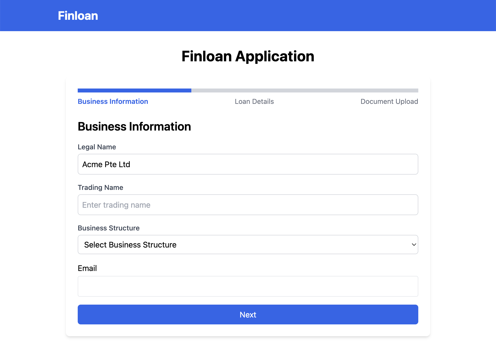
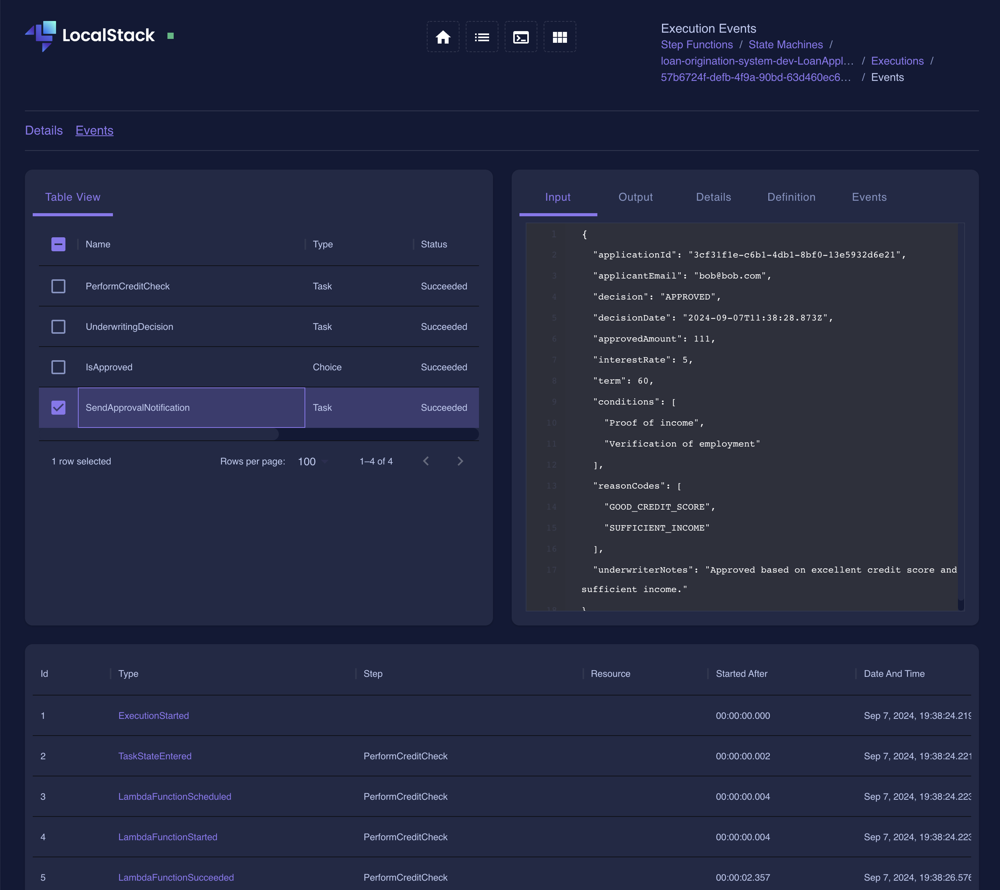

## Serverless system for lending

This project is a serverless system for lending. It is built with the Serverless Framework and leverages AWS services such as API Gateway, Lambda, DynamoDB, and Cognito.

| Sample Frontend | Backend underwriting workflow |
| :-------------: | :---------------------------: |
|   |                 |

### Running LOS

1. cd los
2. npm install
3. docker compose up -d
4. npm run deploy:dev

### Running UI

1. cd ui
2. npm install
3. Create a `.env.local` file in the `ui` directory with the following content:
   ```
   NEXT_PUBLIC_API_BASE_URL=<your_api_gateway_url>
   ```
   Replace `<your_api_gateway_url>` with the actual API Gateway URL from your serverless deployment.
4. npm run dev
